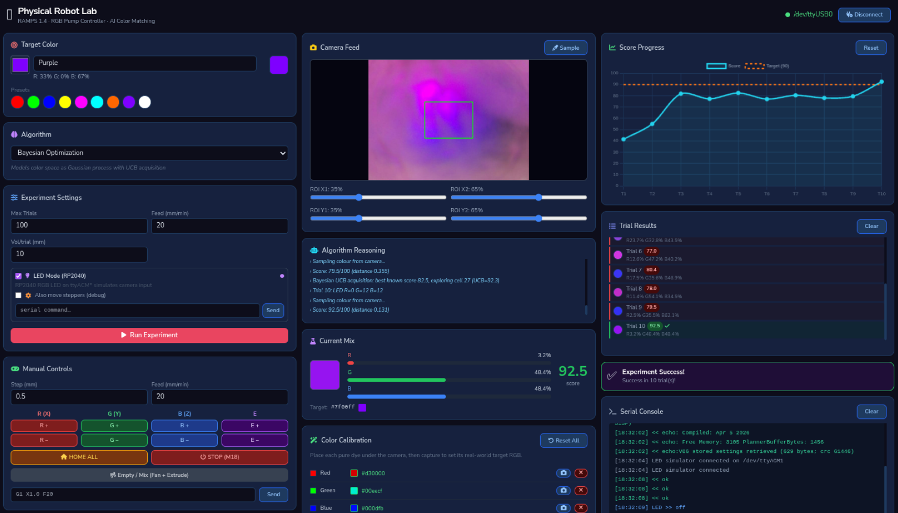
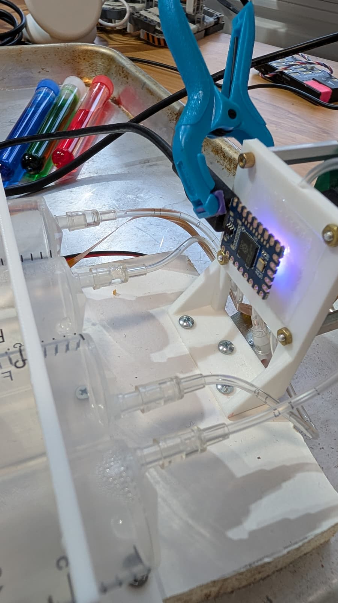

Files for a <$100 minimum "chemputer" that can do closed-loop self-driving lab (SDL) experiments such as color mixing as shown in [this demo](https://lab-automaton.replit.app). 

It has four syringe drives, a 3D-printed microfluidic (actually, more precisely "millifluidic") panel for mixing and a camera mount for color and other measurements. Requires a RaspberryPi

Inside the millifluidic mixer plate is shown here, with three tubes coming into the mixing chamber and one coming out below, with a vent tube at the top to avoid pressure issues


BOM:
- [Steppers with lead screws for linear motion](https://amzn.to/4tf6lsl)
- [Cables with correct 4-pin connectors (splice them into stepper cables, replacing existing connector, which is too small)](https://amzn.to/4tilaLk)
- [Camera](https://amzn.to/4sIcuxi)
- A RaspberryPi of some sort. Pi4b or Pi5 recommended (4GB is fine).
- [RepRap Ramps 1.6 controller](https://amzn.to/4cumjs3)
- [Arduino Mega](https://amzn.to/4cNtHji)
- [Limit switches](https://amzn.to/4sIrRps)
- [30ml syringes](https://amzn.to/4sSEuhK)
- [Solonoid valve for purge line](https://amzn.to/4sHWMS9)
- [Standoffs](https://amzn.to/4mCUNNK)


## Instructions:

For the Ramps 1.6 board:

First, don’t get the older Ramps 1.4 version, which has serious design and QA problems in my experience; among other things the D9 out doesn’t work.

The software that the standard Chinese Ramps manufacturer steers you to is probably broken and rubbish (wrong settings for the LCD panel, which won’t work, and expecting all sorts of 3D printer stuff, like temperature sensors, that you don’t have). Ignore their instructions!

Instead, do this: 

Download the modified Marlin software [here](https://github.com/V1EngineeringInc/MarlinBuilder/releases) (it’s adapted for CNC machines, but that won’t be a problem)

Unzip the files, including the source code zip file inside that zip. In the Arduino IDE, open Marlin.ino from the source folder and that will open a bunch of other files. You’re going to need to go into the library manager and install some libraries as well: U8glib-HAL and U8lib.

Once you’ve installed them, you should be able to compile the code for the Arduino Mega and upload it. This will run and show a menu on the LCD, if you have one. 

To get steppers moving, use Gcode via the Arduino Serial terminal (250000 baud):

G91
G1 X10 F60
G1 X-10 F60

Will move X

M18 will turn off hold current on the steppers if they’re getting hot when not moving.

## Software



Git clone this repo into your RaspberryPi into a directory called pi_app. Run setup.sh. Run the app with this command ``` .venv/bin/python app.py```. Open the app in a browser on the Pi with localhost:5000 or remotely with [pi IP address]:5000

## Using a RGB LED to fake the colors



If you want to use a RP2040 to fake the colored water to avoid water mess while you're testing, I recommend a [Waveshare RP2040-zero](https://amzn.to/4ck8JIR) which you can clamp onto the other side of the mixing chamber window as shown. Switch the RP2040 to CircuitPython by holding down the boot button when you plug it in via USB on your PC and copy over the CircuitPython image you download [here](https://circuitpython.org/board/waveshare_rp2040_zero/) to the drive that shows up. The drive will change its name from "RPI-RP2" to "CIRCUITPY" as explained [here](https://learn.adafruit.com/welcome-to-circuitpython/installing-circuitpython). Copy "neopixel.mpy" from this repo into the "lib" folder on this drive, then copy "code.py" into the root directory. It will start showing rainbow colors, which indicates that you did it right. Plug the board into one of your Pi's USB ports. Once you start the SDL app and click the LED Mode checkbox, the app wil talk to the RP2040 and will change its colors as needed for the experiments.

