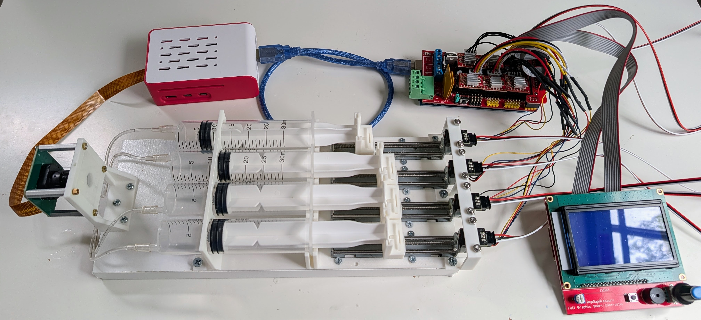
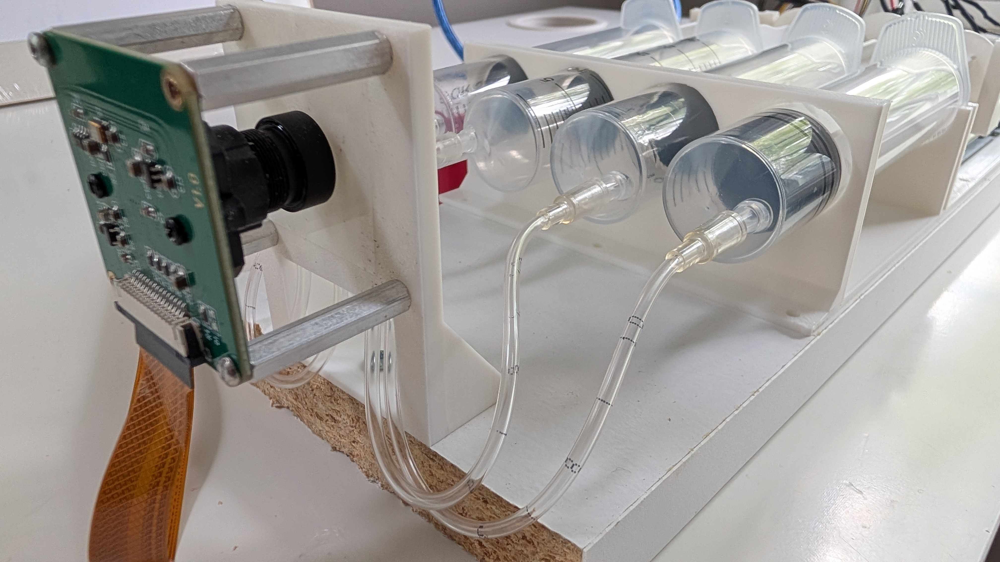

Files for a minimum "chemputer" that can do closed-loop self-driving lab (SDL) experiments such as color mixing as shown in [this demo](https://lab-automaton.replit.app). 

It has four syringe drives, a 3D-printed microfluidic panel for mixing and a camera mount for color and other measurements. Requires a RaspberryPi

BOM:
- [Steppers with lead screws for linear motion](https://amzn.to/4tf6lsl)
- [Camera](https://amzn.to/4sIcuxi)
- [RepRap Ramps controller and Arduino Mega](https://amzn.to/4sIrRps)
- [Limit switches](https://amzn.to/4sIrRps)
- [30ml syringes](https://amzn.to/4sSEuhK)
